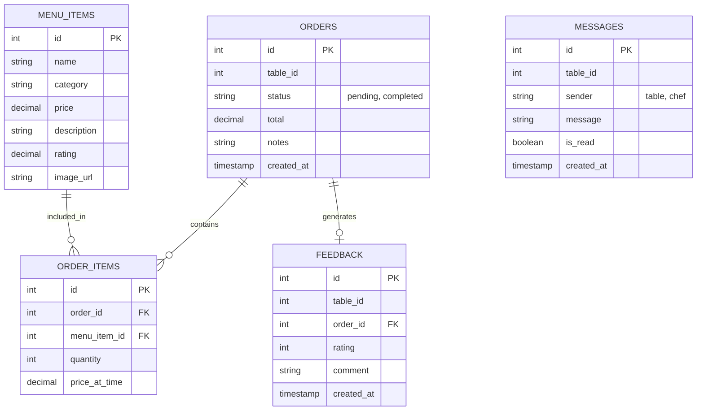

# TableTalk ERD

## Entity Relationship Diagram

## Schema Details
- **MENU_ITEMS**: Stores catalog of available dishes and their image paths.
- **ORDERS**: Tracks the active and historical transactions linked to a specific `table_id`.
- **MESSAGES**: Facilitates the real-time chat feature between a table and the kitchen. Messages are cleared when an order is finalized.
- **FEEDBACK**: Stores anonymous customer reviews.
