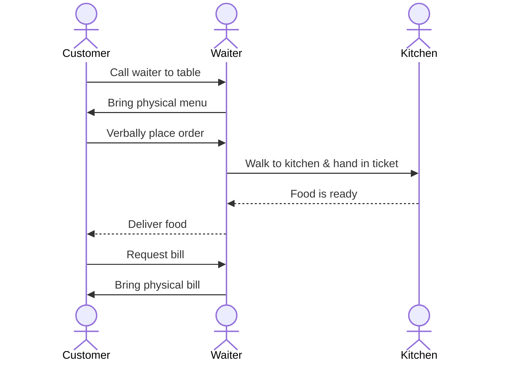
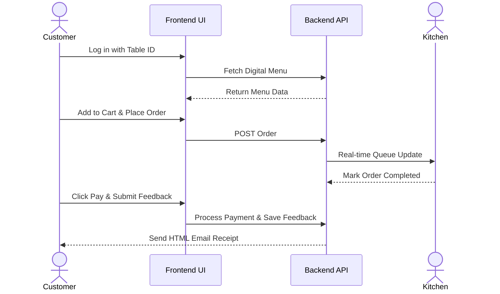

# TableTalk Workflow Swimlanes

## Before TableTalk: Traditional Workflow

```mermaid
sequenceDiagram
    actor Customer
    actor Waiter
    actor Kitchen
    
    Customer->>Waiter: Call waiter to table
    Waiter->>Customer: Bring physical menu
    Customer->>Waiter: Verbally place order
    Waiter->>Kitchen: Walk to kitchen & hand in ticket
    Kitchen-->>Waiter: Food is ready
    Waiter-->>Customer: Deliver food
    Customer->>Waiter: Request bill
    Waiter->>Customer: Bring physical bill
```

## After TableTalk: Digital Workflow

```mermaid
sequenceDiagram
    actor Customer
    participant Frontend UI
    participant Backend API
    actor Kitchen
    
    Customer->>Frontend UI: Log in with Table ID
    Frontend UI->>Backend API: Fetch Digital Menu
    Backend API-->>Frontend UI: Return Menu Data
    Customer->>Frontend UI: Add to Cart & Place Order
    Frontend UI->>Backend API: POST Order
    Backend API->>Kitchen: Real-time Queue Update
    Kitchen-->>Backend API: Mark Order Completed
    Customer->>Frontend UI: Click Pay & Submit Feedback
    Frontend UI->>Backend API: Process Payment & Save Feedback
    Backend API-->>Customer: Send HTML Email Receipt
```
